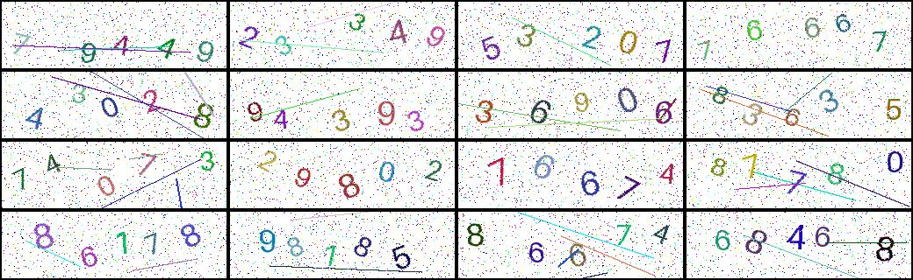

# CS172 Assignment 1: :closed_lock_with_key: CAPTCHAs
Shanghaitech University 2025 Fall Computer Vision I

**This assignment is due on Nov.9 2025 at 11:59 pm**

**If you need to submit an assignment late, you may use up to 7 slip days in total throughout the semester, with a maximum of 4 slip days per assignment. Additional late days incur a 10% penalty per day. Please refer to the course slides for detailed rules about late submissions.**

**If you require an extension beyond the maximum, you must send an email to the instructor or TA at least one week in advance with a valid reason.**



## :rotating_light: Plagiarism Warning
This is an individual assignment. **Plagiarism is strictly prohibited** . Any form of copying or uncredited code-sharing will be treated as an academic violation. The code you submit must be **entirely your own**. You are encouraged to discuss concepts with your peers, but you must write the code yourself. Submissions will be checked for plagiarism using automated tools.

**Consequences of plagiarism** may include:

- Receiving zero points for this assignment.
- Facing further disciplinary actions as per your institution's academic policies.

## :blue_book: Introduction 
Welcome to the first assignment of CS172. In this assignment, you will implement a neural network model to recognize verification codes (*CAPTCHAs*). This will require you to get familiar with neural network fundamentals, image processing, and training pipelines.

Verification codes are commonly used for security purposes. In this assignment, you will build a model to identify these codes from images.

In this assignment, you will:
- Generate synthetic verification code images.
- Preprocess CAPTCHA images.
- Build a neural network that can classify each character in the verification code.
- Train your model on a dataset of verification code images.
- Evaluate the performance of your model and experiment with different architectures and parameters.
- Extend your model to convert numeric CAPTCHAs into alphabetic CAPTCHAs (**Bonus**).

## :card_index_dividers: Files in this assignment
- `main.ipynb` This is the main Jupyter notebook where you'll run the whole pipeline. It contains step-by-step instructions. **Remember to complete the discussion part**.
- `cs172/generate.py` Code for generating synthetic CAPTCHA images. You will modify this to adjust image parameters.
- `cs172/datasets.py` Contains functions for loading and preprocessing the dataset. This file defines a custom PyTorch dataset class to handle verification code images and labels.
- `cs172/networks.py` Contains different neural network architectures. You will implement various architectures here and experiment with different configurations.
- `cs172/utils.py` Utility functions to help with data visualization, model evaluation, and other helper functions.
- `cs172/metrics.py` Utility file containing performance metrics such as accuracy to evaluate your model.
- `cs172/pipeline.py` Functions where you will write your training loop, handle model checkpoints, and integrate data loaders, metrics, and optimizers.
- `samples/` Sample test data folder.
- `README.md` You are reading it!
- `requirements.txt` Lists the Python libraries you need to install to run the assignment.

## :memo: Assignment Parts

### :gear: Part 0: Setup
Make sure you have the necessary dependencies installed:
```
conda create -n 172a1 python=3.8
conda activate 172a1
pip install -r requirements.txt
```

### :framed_picture: Part 1: Data Generation (15 pt)
In this part, you will generate synthetic CAPTCHA images in `generate.py`. Each image will contain random **Arabic numerals (0-9)**. You will:

- Define the parameters for generating the images (e.g. noise level, noise type).
- Modify `generate.py` to generate images with varying characteristics.
- Save the generated images and their corresponding labels in the `data/` folder.

To receive full points, your implementation **must** include random colors, positions, and rotations for the digits, as well as two types of added noise. Full points examples can be found in the reference images above.

### :bar_chart: Part 2: Dataset Class and Data Preprocessing (15 pt)
Once you have generated the dataset, you will load and preprocess the images using the `dataset.py` file. You will:

- Implement a custom dataset class using PyTorch's `torch.utils.data.Dataset` to handle image loading and labeling.
- Preprocess the images by **resizing**, **normalizing**, and converting them into a format suitable for neural network input.
- Use the `DataLoader` class to batch the data and split it into training and validation sets.

### :building_construction: Part 3: Model Building (20 pt)
In this part, you will build your neural networks using PyTorch. You will:
- Implement several neural network architectures in `networks.py`. You can start with the **ResNet18** architecture, but you may also use other architectures as alternatives. You can find detailed implementation guidance in `main.ipynb`.

- Return to `main.ipynb` to train and evaluate the models.

### :dart: Part 4: Training the Model (10 pt)
In `pipeline.py`, you will train your model on the generated dataset by:
- Defining the loss function (e.g., Cross Entropy Loss) and optimizer (e.g., Adam).
- Run back propagation and gradient descent algorithm.
- Monitoring the loss and accuracy during training and making adjustments if necessary.
- Use regularization techniques to prevent overfitting if necessary.

To receive full points, your model **must** achieve a digit accuracy greater than 0.9 and an image accuracy greater than 0.7 on the training set you generated.

### :chart_with_upwards_trend: Part 5: Evaluation (30 pt)
After training, you will evaluate your model on the test set. You will:
- Experiment with various hyperparameters such as Learning rates, Batch sizes, Network architecture (e.g., number of layers, filter sizes, and activations) on your own generated validation set. Report the best-performing model configuration and analyze its results. **(10 pt)**
- Report the accuracy of the model on unseen test data. Five test sets are provided in advance. To receive full points for each test set, your model **must** achieve a digit accuracy ≥ **0.95** and an image accuracy ≥ **0.75**.
- Visualize some predictions and compare them with the ground truth labels.
- Investigate and analyze failure cases (incorrect predictions) to understand how to improve the model.

### :speech_balloon: Part 6: Discussion (10 pt)
While completing the previous coding tasks, you may come across 11 discussion questions in `main.ipynb`. You need to answer all of them, each worth 1 point.

### :sparkles: Bonus: Alphabet CAPTCHA Recognition (10 pt)

The models you implemented earlier were designed to recognize numeric CAPTCHAs containing digits (0–9). In this bonus part, you are encouraged to extend your model to handle alphabetic CAPTCHAs, where each character may be an uppercase or lowercase letter.

There are no strict requirements for the model architecture, training setup, or implementation details — you are free to explore different approaches, such as:
- Adjusting the data generation pipeline to produce letter-based CAPTCHA images.
- Modifying your existing model to classify alphabetic characters.
- Experimenting with a new network architecture for alphabetic CAPTCHAs.

We will provide a set of pre-generated alphabet CAPTCHA images for test.

To complete this part, you should:
- Show several examples of the training data you used.
- Report your training accuracy.
- Report your accuracy on the provided test set.
- Report the modifications you made compared to the numeric CAPTCHA setting (e.g., data generation, model architecture, or training strategy).

This part encourages creativity — bonus points will be awarded based on the completeness and quality of your results. With the bonus included, the highest score is **110** points.

 **If you find it difficult, feel free to skip it.**

## :outbox_tray: Submission
Please submit the following files :
- Export `main.ipynb` as a `pdf` file to **BlackBoard**. **Remember to complete the discussion part in the notebook**.
- Submit a `zip` file (`ChineseName-StudentID.zip`) of your entire project directory (**WITHOUT DATA FOLDER !!! Including it will result in a point deduction!**) to [ShanghaiTech EPAN](https://epan.shanghaitech.edu.cn/l/lFUzAh). Make sure your `main.ipynb` can be run directly and matched with the output of your `pdf` file, we will check it.

**Repeat!**

**This assignment is due on Nov.9 2025 at 11:59 pm**

**If you need to submit an assignment late, you may use up to 7 slip days in total throughout the semester, with a maximum of 4 slip days per assignment. Additional late days incur a 10% penalty per day. Please refer to the course slides for detailed rules about late submissions.**

**If you require an extension beyond the maximum, you must send an email to the instructor or TA at least one week in advance with a valid reason.**

Good luck, and have fun with the assignment! :tada: